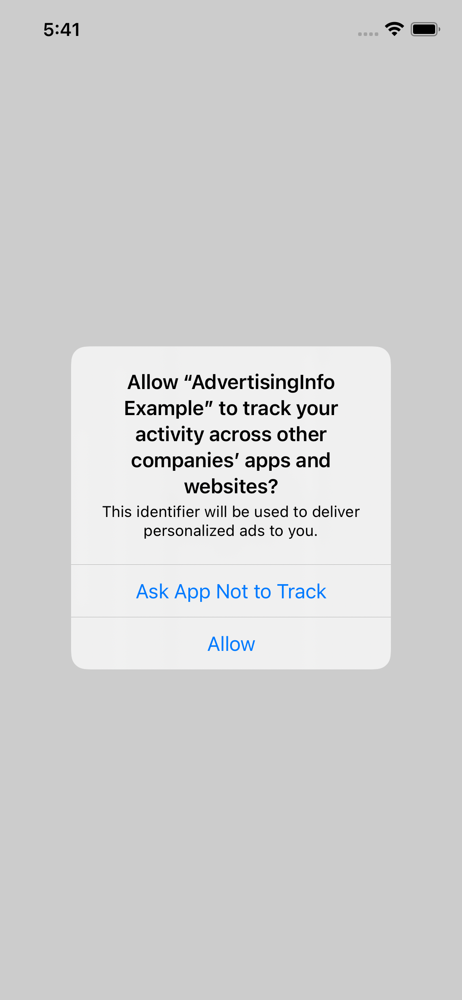
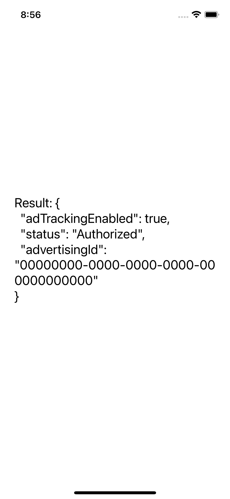

# react-native-advertising-info

With this module you are able to get advertising identifier in your React Native project. 
<br/>
(`IDFA` for iOS, and `AAID` for Android) 

<br/>
<div>


</div>

## Installation

```sh
yarn add react-native-advertising-info
# or 
npm install react-native-advertising-info
```

## Platforms and configuration
- <b>Android</b>:
  <br/>
  No additional configuration required

- <b>iOS</b>:

```sh
cd ios && pod install
```

```swift
// Info.plist
<key>NSUserTrackingUsageDescription</key>
<string>Your usage description here</string>
```

## Usage
In your React Native app use one of these:

#### getAdvertisingInfo

```tsx
import { getAdvertisingInfo } from 'react-native-advertising-info'

React.useEffect(() => {
    getAdvertisingInfo().then((adInfo) => console.log(adInfo))
}, [])
```

or 

#### useAdTrackingInfo

```tsx
import { useAdTrackingInfo } from 'react-native-advertising-info'

const adInfo = useAdTrackingInfo()
```

## Types

```ts
// Response
type AdvertisingInfo = {
    adTrackingEnabled: boolean
    advertisingId: string
    status: TrackingStatus
}

// TrackingStatus
type TrackingStatus = 'Authorized' | 'Denied' | 'Not Determined' | 'Restricted' | 'Unknown' | 'Not Required'
```

#### <b>adTrackingEnabled</b>
- <b>true</b>:  status `Authorized` or `Not required` 
- <b>false</b>: different status

#### <b>advertisingId</b>
Phone advertising identifier. Empty string if tracking not enabled

#### <b>status</b>
For Android devices the request prompt isn't required and status is either:
- `Not Required` - default
- `Denied` - A user has blocked tracking globally in phone settings
<br/>

For iOS < 14 the request prompt isn't required and the status is `Not Required`
<br/>
For iOS >= 14 the request prompt <b>is</b> required. The status can be one of these [values](https://developer.apple.com/documentation/apptrackingtransparency/attrackingmanager/authorizationstatus)


## Example
You can find an exmaple [here](https://github.com/iceu-bb/react-native-advertising-info/blob/master/example/src/App.tsx)


## License

MIT

## Contributing

See the [contributing guide](CONTRIBUTING.md) to learn how to contribute to the repository and the development workflow.
